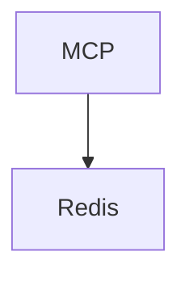

# Agent Provocateur System

A containerized system for document processing and analysis with a modern web interface.

## Prerequisites

- Podman (not Docker)
- Python 3.8 or higher
- Node.js 18 or higher
- Redis server
- uv (Python package manager)
- ruff (Python linter)

## Initial Setup

1. **Create required directories:**
   ```bash
   mkdir -p logs data
   ```

2. **Install uv and ruff:**
   ```bash
   # Install uv
   curl -LsSf https://astral.sh/uv/install.sh | sh
   
   # Install ruff
   uv pip install ruff
   ```

3. **Set up Python environment:**
   ```bash
   # Create and activate virtual environment
   python -m venv venv
   source venv/bin/activate  # On Unix/macOS
   # or
   .\venv\Scripts\activate  # On Windows
   
   # Install dependencies using uv
   uv pip install -e .[redis]
   ```

4. **Set up Frontend:**
   ```bash
   # Install Node.js dependencies
   cd frontend
   npm install
   
   # Build API client
   npm run build:api
   
   # Start frontend in development mode
   npm run dev
   ```

5. **Start Redis:**
   ```bash
   # On macOS with Homebrew
   brew services start redis
   
   # On Linux
   sudo systemctl start redis
   
   # Or using Podman
   podman run -d --name redis -p 6379:6379 redis:latest
   ```

## Architecture

Tested using Podman, NOT docker.

### Core Services
- **MCP Server** (Port 8000): Main control server handling document processing
- **Redis** (Port 6379): Cache and message broker

## Port Management

The system uses a consistent port configuration for all services:

### Service Ports
- Frontend: Port 4001 (host) → 3001 (container)
- MCP Server: Port 4002 (host) → 8000 (container)
- Redis: Port 4003 (host) → 6379 (container)
- Ollama: Port 4004 (host) → 11434 (container)
- Grafana: Port 4005 (host) → 3000 (container)
- Prometheus: Port 4006 (host) → 9090 (container)

### Port Configuration

1. **Frontend**
   - Port: 4001:3001
   - Health Check: `http://localhost:4001/api/health`
   - Configuration: Set in `docker-compose.yml`

2. **MCP Server**
   - Port: 4002:8000
   - Health Check: `http://localhost:4002/api/health`
   - Configuration: Set in `docker-compose.yml`

3. **Redis**
   - Port: 4003:6379
   - Access: `localhost:4003`
   - Configuration: Set in `docker-compose.yml`

4. **Ollama**
   - Port: 4004:11434
   - Access: `localhost:4004`
   - Configuration: Set in `docker-compose.yml`

5. **Grafana**
   - Port: 4005:3000
   - Access: `http://localhost:4005`
   - Default admin password: `agent_provocateur`
   - Configuration: Set in `docker-compose.yml`

6. **Prometheus**
   - Port: 4006:9090
   - Access: `http://localhost:4006`
   - Configuration: Set in `docker-compose.yml`

### Port Validation

To check if all required ports are available:
```bash
# Check all required ports
for port in 4001 4002 4003 4004 4005 4006; do
    if lsof -i :$port > /dev/null 2>&1; then
        echo "Port $port is in use"
    else
        echo "Port $port is available"
    fi
done
```

### Port Conflict Resolution

If you encounter port conflicts:
1. Check which process is using the port:
   ```bash
   lsof -i :<port_number>
   ```
2. Either stop the conflicting process or modify the port mapping in `docker-compose.yml`
3. For development, you can use different port ranges by modifying the port mappings in `docker-compose.yml`

## Quick Start

The system uses `podman-compose` to manage all services. Do not start services individually unless specifically needed for development.

1. **Start all services:**
   ```bash
   # First, ensure no containers are running to avoid port conflicts
   podman rm -f $(podman ps -aq)
   
   # Start the full stack
   podman-compose up -d
   ```

2. **Verify services are running:**
   ```bash
   # Check container status
   podman ps
   
   # Verify frontend health
   curl http://localhost:4001/api/health
   
   # Verify backend health
   curl http://localhost:4002/api/health
   ```

3. **Access the services:**
   - Frontend UI: http://localhost:4001
   - Backend API: http://localhost:4002
   - Grafana Dashboard: http://localhost:4005 (admin password: agent_provocateur)
   - Prometheus Metrics: http://localhost:4006

4. **Stop all services:**
   ```bash
   podman-compose down
   ```

## Starting and Testing Services

### Manual Service Startup

If you need to start services individually for development or testing:

1. **Start Redis:**
   ```bash
   # Start Redis on port 6111
   redis-server --port 6111
   
   # Verify Redis is running
   redis-cli -p 6111 ping
   ```

2. **Start MCP Server:**
   ```bash
   # Start the MCP server
   python -m agent_provocateur.mcp_server
   
   # Verify MCP server is running
   curl http://localhost:4002/api/health
   ```

3. **Start Frontend:**
   ```bash
   # Start the frontend server
   cd frontend
   python server.py --port 4001 --backend-url http://localhost:4002
   
   # Verify frontend is running
   curl http://localhost:4001/api/health
   ```

### Testing Service Connectivity

1. **Test Frontend API Endpoints:**
   ```bash
   # Health check
   curl http://localhost:4001/api/health
   
   # System info
   curl http://localhost:4001/api/info
   
   # Debug configuration
   curl http://localhost:4001/api/debug/config
   
   # Document list
   curl http://localhost:4001/api/documents
   ```

2. **Test Backend API Endpoints:**
   ```bash
   # Health check
   curl http://localhost:4002/api/health
   
   # System status
   curl http://localhost:4002/api/system/status
   
   # Document list
   curl http://localhost:4002/documents
   ```

3. **Test Redis Connection:**
   ```bash
   # Test Redis connection
   redis-cli -p 4003 ping
   
   # Check Redis info
   redis-cli -p 4003 info
   ```

### Troubleshooting Service Issues

1. **Port Conflicts:**
   ```bash
   # Check if ports are in use
   lsof -i :4001  # Frontend
   lsof -i :4002  # Backend
   lsof -i :4003  # Redis
   
   # Kill processes using ports if needed
   kill -9 $(lsof -t -i:4001)
   kill -9 $(lsof -t -i:4002)
   kill -9 $(lsof -t -i:4003)
   ```

2. **Service Logs:**
   ```bash
   # Check frontend logs
   tail -f frontend/logs/server.log
   
   # Check backend logs
   tail -f logs/mcp_server.log
   
   # Check Redis logs
   tail -f /var/log/redis/redis.log
   ```

3. **Common Issues:**
   - If frontend shows "Backend Unavailable": Check if MCP server is running
   - If document upload fails: Check Redis connection
   - If services can't connect: Verify port mappings in config/ports.json

### Service Dependencies

The system has the following service dependencies:

1. **Required Services:**
   - Frontend (4001) → MCP Server (4002)
   - MCP Server (4002) → Redis (4003)

2. **Optional Services:**
   - Ollama (7111) - For LLM features
   - Grafana (3111) - For monitoring
   - Prometheus (9111) - For metrics

Start services in this order:
1. Redis
2. MCP Server
3. Frontend
4. Optional services (if needed)

## Testing

### System Testing

1. **Pre-test Setup:**
   ```bash
   # Clear any running containers
   podman rm -f $(podman ps -aq)
   
   # Start fresh stack
   podman-compose up -d
   ```

2. **Port Validation:**
   ```bash
   # Run port validation script
   ./scripts/validate_ports.sh
   ```

3. **Health Checks:**
   ```bash
   # Check frontend health
   curl http://localhost:4001/api/health
   
   # Check backend health
   curl http://localhost:4002/api/health
   
   # Check Redis connection
   curl http://localhost:4003/ping
   ```

4. **Document Processing Test:**
   ```bash
   # Upload test document
   curl -X POST -F "file=@test.xml" http://localhost:4002/xml/upload
   
   # List documents
   curl http://localhost:4002/api/documents
   ```

### Component Testing

When testing individual components, ensure other services are stopped first:

1. **Test MCP Server Only:**
   ```bash
   # Stop all services
   podman-compose down
   
   # Start MCP server
   ./scripts/manage_mcp.sh start
   
   # Check status
   ./scripts/manage_mcp.sh status
   ```

2. **Test Frontend Only:**
   ```bash
   # Start frontend container
   podman run -d -p 4001:3001 agent-provocateur/frontend
   ```

### Common Issues

1. **Port Conflicts:**
   - Always use `podman rm -f $(podman ps -aq)` before starting services
   - Never mix individual service starts with podman-compose
   - Use `./scripts/validate_ports.sh` to check port availability

2. **Connection Issues:**
   - Ensure backend URL is correctly set to http://localhost:4002
   - Check container networking with `podman network inspect podman`
   - Verify all services are healthy with `podman ps`

3. **Data Persistence:**
   - Check volume mounts in `docker-compose.yml`
   - Verify data directories exist: `logs/`, `data/`
   - Check file permissions on mounted volumes

## Development

For development work:

1. **Local Development:**
   ```bash
   # Start dependencies only
   podman-compose up -d redis grafana prometheus
   
   # Run frontend locally
   cd frontend && python server.py
   
   # Run backend locally
   cd backend && python -m agent_provocateur.mcp_server.__main__
   ```

2. **Code Changes:**
   ```bash
   # Format code
   ruff format .
   
   # Run linter
   ruff check .
   
   # Apply fixes
   ruff check --fix .
   ```

## API Endpoints

The system exposes several API endpoints through the MCP server:

### Document Management
- `GET /api/documents`: List all documents
- `GET /api/documents/{id}`: Get document details
- `POST /xml/upload`: Upload new document

### Task Management
- `POST /task`: Create new task
- `GET /task/{id}`: Get task status
- `GET /task/{id}/result`: Get task results

### Agent Operations
- `GET /agents`: List all agents
- `POST /agents/{id}/start`: Start an agent
- `POST /agents/{id}/stop`: Stop an agent

## Service Dependencies



## Troubleshooting

1. **Service not starting:**
   ```bash
   # Check service logs
   ./scripts/manage_mcp.sh logs
   ```

2. **Port conflicts:**
   ```bash
   # Check if port is in use
   lsof -i :8000
   ```

3. **Container health:**
   ```bash
   # Check health endpoint
   curl http://localhost:8000/api/health
   ```

4. **Redis connection issues:**
   ```bash
   # Check if Redis is running
   redis-cli ping
   
   # If using Podman Redis container
   podman ps | grep redis
   
   # Check Redis logs
   podman logs redis
   ```

5. **Common Redis issues:**
   - If Redis connection fails, ensure Redis is running and accessible
   - Check Redis port (6379) is not blocked by firewall
   - Verify Redis container is running if using Podman
   - Try restarting Redis if connection issues persist

## Best Practices

1. Always use the provided scripts for managing services
2. Check logs in `./logs` directory for debugging
3. Run health checks after configuration changes
4. Keep port configuration simple and consistent
5. Use standard ports where possible